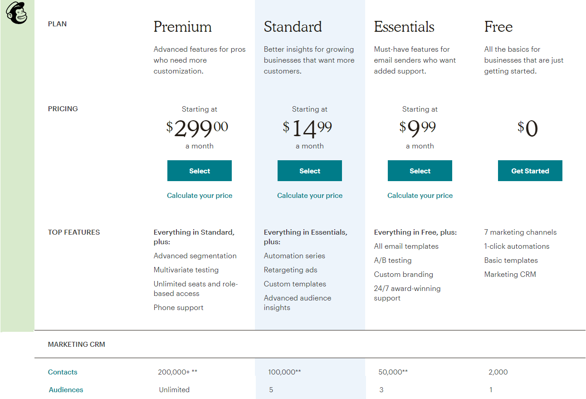

Since I based the implementation of this Gastby site out of [Dan Abramov's Overreacted](https://github.com/gaearon/overreacted.io), I had to make a few changes. One of them was the subscribe feature that Dan uses on his site with [Convert Kit](http://convertkit.com). I was not able to find a free tier to start up with them and I wanted to keep things simple so after a bit of research, I found that [Mailchimp](http://mailchimp.com) is a pretty solid option. They have a free plan for up to 2,000 subscribers for a single group audience which is more than enough for a starting blog site.



### Setting up your Mailchimp Account
This process is very simple and you only need to head over [Mailchimp's free tier registration page](https://login.mailchimp.com/signup/?plan=free_monthly_plan_v0) to create your account so you get access to configure it.

### Gatsby Mailchimp Plugin
Fortunately, the contributed Gatsby plugin [gatsby-plugin-mailchimp](https://www.gatsbyjs.org/packages/gatsby-plugin-mailchimp/) facilitates the process of this integration. This plugin is fantastic, You can pretty much follow the instructions on the documentation page and it will get you almost there! 

However, the documentation is a bit dated (Mailchimp has changed its layout) so it can get a bit confusing when you are reading through.

The things you should consider when you read the documentation are:
- **Mailchimp Endpoint**
    1. Login to your Mailchimp account
    2. Click **Audience** tab at the top
    3. From the dropdown on the right select: "Signup forms"
    4. Click “Embedded forms”
    5. Continue with the remaining instructions from the documentation
- **Gatsby Import Plugin Instructions**
    For this section, you can take a look at the example there but I found the example inside the plugin way more useful, you can find it on the [gatsby-plugin-mailchimp Github repository](https://github.com/benjaminhoffman/gatsby-plugin-mailchimp/blob/master/examples/gatsby-v2/src/pages/index.js)


### Troubleshooting
If for some reason you are getting an error on your JavaScript console like these:
```
SyntaxError: expected expression, got '<'
```
```
was loaded even though its MIME type (“text/html”) is not a valid JavaScript MIME type
```
Or if you are getting Mailchimp's **404 Page not Found** errors when you perform the request. It might be because the URL you copied from the Mailchimp embeddable form is wrong. I did not realize this after I looked at it with a microscope! The issue for me was that the URL I copied from the form action element contained HTML encoded characters, in my case, it was something like this:

`https://gmail.us3.list-manage.com/subscribe/post?u=xxxxxxxxxxxxxxxxxxxxxx&amp;id=xxxxxxxxxxxxx` 

see that `amp;` over there? the correct URL should be something like this: 

`https://gmail.us3.list-manage.com/subscribe/post?u=xxxxxxxxxxxxxxxxxxxxxx&id=xxxxxxxxxxxxx` 

That was one of my biggest issues when I was debugging these errors, Just make sure that you don't have encoded characters in your URL string and that your user and id strings are also correct.

Another interesting thing I learned when I was experimenting with this on POSTMAN and taking a look at the plugin code is that the last part of the URL needs to be `post-json` instead of `post`. If you are using this plugin you should not worry about it or change that in your gatsby-config.js configuration file, the plugin takes care of that automatically and converts that part of the URL string for us!

Lastly, I was running into an issue where I was not being able to correctly map the name of my subscribers when they were filling the Subscribe form. None of the examples tell you very clearly how to send extra fields to Mailchimp and if you are struggling like I was, I can show you how I was able to do it.

If you did not change any of the field mappings on your Mailchimp Embeddable Form configuration you will notice that they already have some defaults:
You can get there by clicking on:

 **Audience -> (Manage Audience dropdown) -> Signup Forms -> Embedded Forms -> Settings -> Audience Fields and *|MERGE|* tags**

 Once there, you will see the names that Mailchimp is expecting you to send, for example the default tag for name is FNAME, if you want Mailchimp to store these fields (or others you might need) you need to send a JSON object with these keys and values as the second argument of the `addToMailchimp` function, for instance:

 ```JSX
 addToMailchimp(this.state.email, {'FNAME': this.state.name})
 ```

 You don't have to worry about wrapping email in a JSON object because the plugin will take care of sending that correctly (You cannot change that tag on Malchimp's configuration).

 Please let me know if any of this information was helpful to you, see you in the next post!

 g.


