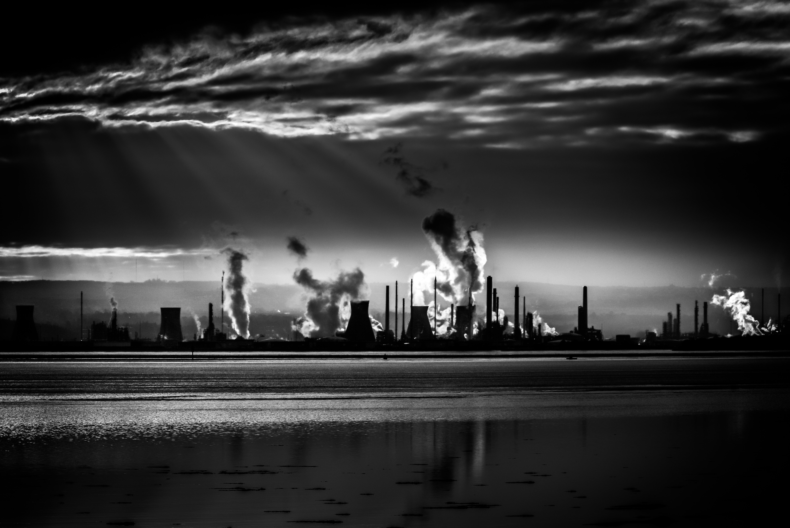
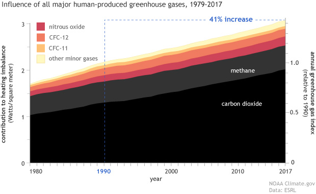
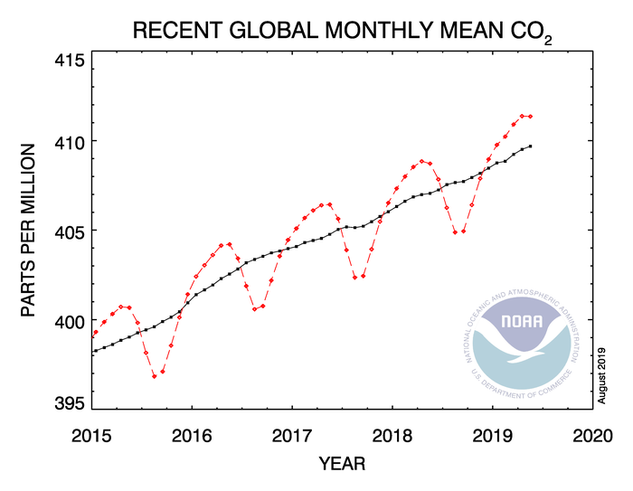
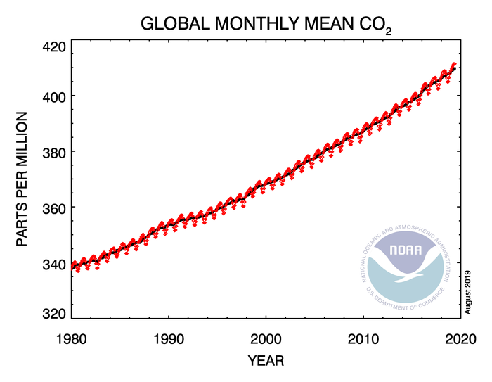
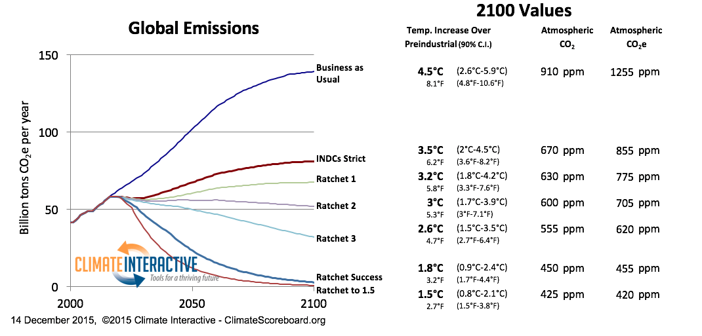
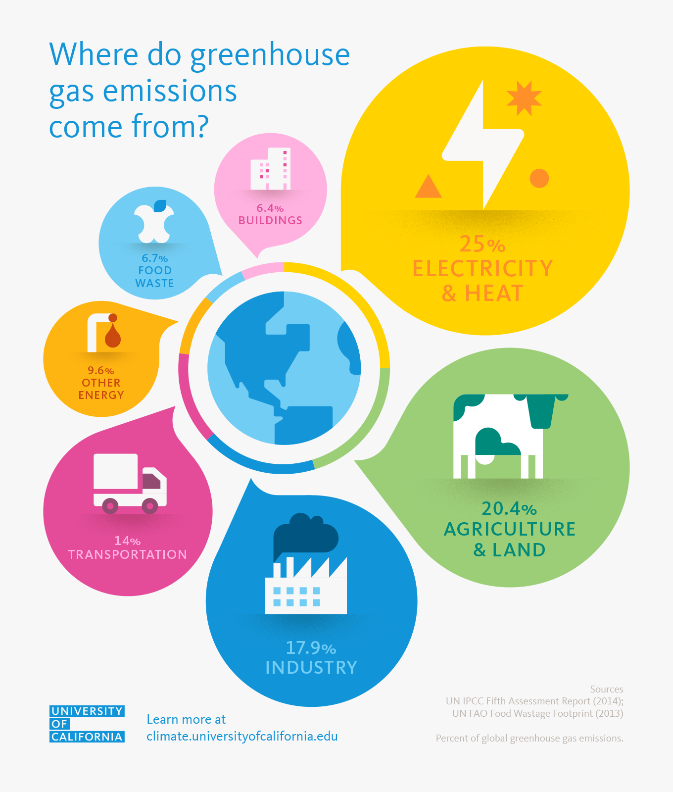

### 1. What is CO2 PPM?
PPM stands for Parts Per Million and those are the units we use to measure the concentration levels of Carbon Dioxide in the atmosphere.  PPM Usually describes the concentration of something in water or soil. One ppm is equivalent to 1 milligram of something per liter of water (mg/l) or 1 milligram of something per kilogram soil (mg/kg). The number you see in this blog is the weekly average CO2 concentration in our atmosphere. This data comes from an API that parses the official [RSS feed](http://www.esrl.noaa.gov/gmd/webdata/ccgg/trends/rss.xml) from the [NOAA/ESRL](https://www.esrl.noaa.gov/) (National Oceanic and Atmospheric Administration / Earth System Research Laboratory).

The actual measurement comes from Mauna Loa Observatory (MLO), an atmospheric station part of NOAA's Earth System Research Laboratory located on the Hawaiian volcano of Mauna Loa. Because this observatory is high up in the middle of the Pacific Ocean and is away from any sources on the ground, provides MLO a particular advantage when measuring CO2 levels. These levels have been recorded there since the 1950s.

### 2. CO2 Impact in Our Planet
Carbon Dioxide is a greenhouse gas. A greenhouse gas is a gas that absorbs or emits radiant energy, in the atmosphere, these gases do not let escape the energy and heat from the sun causing the entire planet to warm up. The primary greenhouse gases in Earth's atmosphere are water vapor, carbon dioxide, methane, nitrous oxide, and ozone. Without greenhouse gases, the average temperature of Earth's surface would be about −18 °C (0 °F), rather than the present average of 15 °C (59 °F).

Human activities since the beginning of the Industrial Revolution (around 1750) have produced a 45% increase in the atmospheric concentration of carbon dioxide (CO
2), from 280 ppm in 1750 to 406 ppm in early 2017.

At current emission rates, temperatures could increase by **2 °C**, which the United Nations' [IPCC (Intergovernmental Panel on Climate Change)](https://www.ipcc.ch/) designated as the upper limit to avoid **dangerous** levels.

### 3. Atmospheric Trends
At the time of writing this post (August 2019) these are the recorded levels and trends of CO2 in our atmosphere:

There is a correlation between these CO2 levels and the ºC increase measured at pre-industrial levels

What are the consequences of reaching a 4ºC increase if we continue business as usual? Most projections show that in most cases, CO2 should exceed 500 ppm by the year 2050, if not sooner. That’s only 30 years away, a lot of these models do not consider the methane that is being released from permafrost and the devastating effects that this would have. A child born today will experience CO2 levels of 500 ppm when he or she is in their 30s or possibly even 20s. The hundred-point rise between 300 to 400 ppm took about a century; the rise between 400 to 500 ppm will take only about 30 years, and with accelerating rates, the rise to 600 ppm and eventually 900 ppm will happen even faster.

Drowned cities, stagnant seas, intolerable heatwaves, entire nations uninhabitable… and more than 11 billion humans. A four-degree-warmer world is the stuff of nightmares and yet that’s where we’re heading in just decades. [more here.](https://www.theguardian.com/environment/2019/may/18/climate-crisis-heat-is-on-global-heating-four-degrees-2100-change-way-we-live)

### 4. Biggest Contributors

Even though animal agriculture is not the top greenhouse gas contributor, it has many other side effects that make this the cruelest and most destructive force in our planet today:

By causing deforestation (about 91% of Amazon's destruction), our planet's natural capacity to capture CO2 from the atmosphere with trees is diminished, Animal agriculture produces huge amounts of Methane which is 40 times more powerful than CO2 to capture heat and it also requires insane amounts of fresh water. One of the issues that is overlooked a lot of times is the cruelty in which this industry is allowed to operate, but this is a topic for another post.

### 5. Ok, How Much Is Too Much Then?
We are currently at the safe top limit of CO2 in our atmosphere, We've already warmed the Earth by 1.5ºC and some irreversible tipping points have already been reached, like the massive loss of ice sheet all around the planet, even though some of these effects are not reversible, we are still at a point where we can avoid catastrophic damage to our planet. If we get to 4C or about 700 CO2 ppm (and that is the current trend and estimate we will hit within a few decades) we will experience catastrophic collapse of major ecosystems and a huge and irreversible impact to human civilization.

### 6. Individual actions you can take to reduce your carbon footprint

