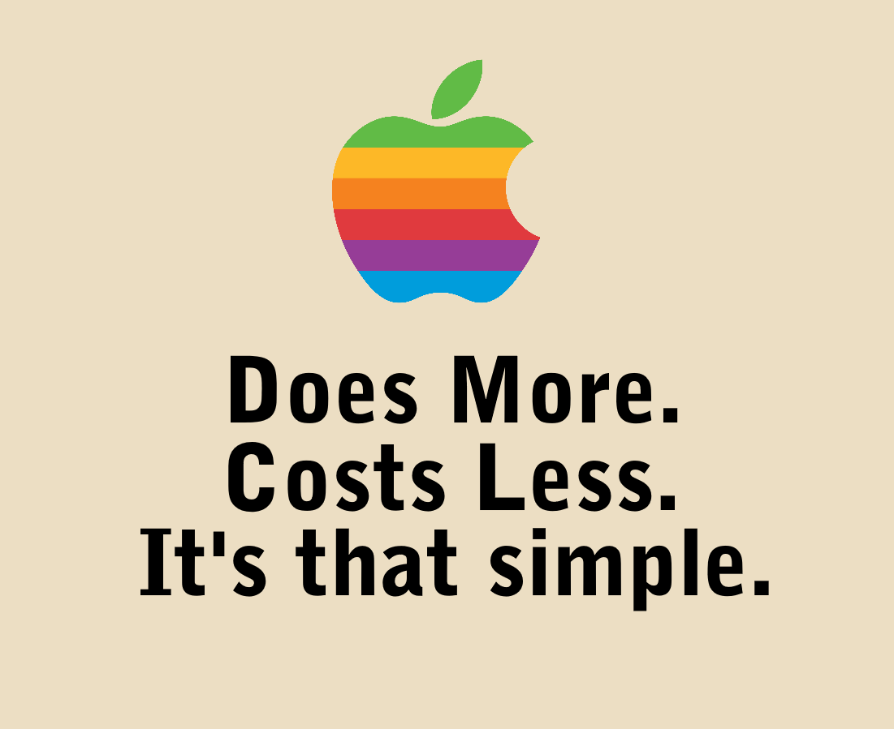

---
title: From OSX to Windows, Why Did I Do It And Why You Should Try It Too!
date: '2019-08-24'
spoiler: Tips and secrets for web developers inside.
--- 

For a long time, Apple MacBook Pros have been the tool of choice for modern web developers, altough I have to admit, I have seen in my carreer several developers using Windows computers as well with stacks like xaamp and the likes, I won't get into that discussion and into that rabbit hole but One of the things that made Apple very successful with developers and in particular web developers is that Mac OSX is a UNIX based system and we get all the fun and cool stuff that we also run in our servers.

Another thing to consider is that I believe that Apple has a very good quality assurance process with their equipment, and for a long time in the Windows laptop realm, it has been hit and miss.

The option we were left with was to purchase one of these windows laptops and install linux on them, (and yes, we've had linux cetified laptop computers for a while) and while I have tried this alternative myself in the past, it has never been a clean experience, interface issues, graphic issues, and driver problems have been an issue with linux and the diversity of equipment you could buy, the linux experience gets better and better everyday Distributions like Ununtu, linux mint (add others) and others bring Linux closer and closer to mass consumers everyday.

### Why did I consider the switch

That is Apple tag line during 1993, I found an [interesting article analizing this on Business Insider that explores the topic a bit more](https://www.businessinsider.com/old-apple-ads-compared-to-modern-apple-2018-11#it-eventually-started-to-distance-itself-from-the-business-market-or-at-least-appeal-to-a-non-business-crowd-with-its-get-a-mac-campaign-starting-in-2006-4). Howerver to me, when I read that and try to apply in 2019 it does not make sense, here a quick example for a couple of configurations using the latest apple macbook and the latest model for the Lenovo thinkpad P52:

Why Lenovo Thinkpad?

[Latest 2019 Apple Macbook Pro model configuration](./screencapture-apple-shop-buy-mac-macbook-pro-15-inch-space-gray-2-3ghz-8-core-processor-with-turbo-boost-up-to-4-8ghz-512gb-2019-08-25-14_33_18.png "Latest 2019 Apple Macbook Pro model configuration.")

[Lenovo P52 model congifuration](./screencapture-lenovo-us-en-laptops-thinkpad-thinkpad-p-P52-p-20M9CTO1WWENUS0-customize-2019-08-25-14_33_38.png "Latest 2019 Apple Macbook Pro model configuration.")

### Apple Macbook Pro vs Lenovo Thinkpad P52

|  | 2019 Apple Macbook Pro | Lenovo Thinkpad P52 |
| --- | ----------- | ---- |
| Processor | 2.3GHz 8‑core 9th‑generation Intel Core i9 processor, Turbo Boost up to 4.8GHz | 8th Generation Intel® Core™ i7-8850H 6 core processor with vPro™ (2.60GHz, up to 4.30GHz with Turbo Boost Technology, 9MB Cache) |
| Display | 15.4-inch (diagonal) LED-backlit Retina display with IPS technology; 2880-by-1800 native resolution at 220 pixels per inch with support for millions of colors, 16:10 aspect ratio | 15.6” UHD 4K (3840 x 2160, 400nits) IPS multi-touch, 100% Adobe color gamut |
| Memory | 16GB 2400MHz DDR4 | 16GB DDR4 2400MHz |
| Graphics | Radeon Pro 560X 4GB | NVIDIA Quadro P1000 4GB |
| Storage | 512GB SSD storage | 512GB SSD PCIe-NVMe M.2 |
| Ports | Four Thunderbolt 3 (USB-C) ports | 3 x USB 3.1 Gen 1, 2 x USB 3.1 Type-C / Intel Thunderbolt™ 3, HDMI 2.0, 4-in-1 card reader (SD, SDHC, SDXC, MMC), Headphone/mic combo jack, Mini DisplayPort 1.4, Smart card reader, RJ45 Gigabit Ethernet | 
| Weight | 4.02 pounds (1.83 kg) | 5.4 lbs (2.45 kg) |
| Price | $2,799.00 | $1,928.70 |

A few other things to have in mind, if you need to upgrade anything on the MacBook pro you are out of luck, however if you need an additional hard drive, more ram memory or a brand new battery, those are all things you can do with a thinkpad.

### WSL?
Explain what is this

### Steps to configure your WSL development environment
Paste the blog posts, explain what they do
Add some screenshots from your env
Explain how to export the WSL filesystem

### Conclusion

